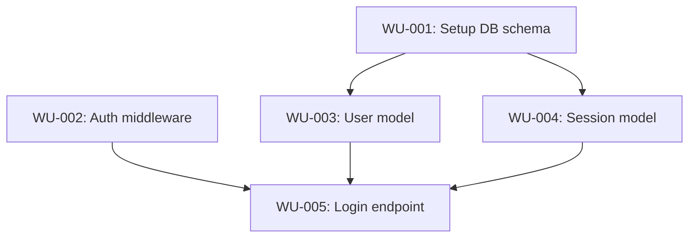

# State Schema

## state.json

The orchestrator reads and writes this file throughout the workflow. The planner creates it in mode 0 and updates it in modes 1 and 2.

```json
{
  "version": 1,
  "branch": "feature/my-feature",
  "pr_number": null,
  "current_phase": "sketching | executing | complete",
  "repo_root": "/path/to/repo",
  "problem_statement_file": "problem-statement.json",
  "traceability_matrix": {
    "AC-001": {
      "description": "string",
      "implementing_wus": ["WU-001", "WU-003"],
      "target_files": ["src/foo.ts", "src/bar.ts"]
    }
  },
  "work_units": {
    "WU-001": {
      "id": "WU-001",
      "title": "string — short human-readable title",
      "file": "work-units/WU-001.md",
      "solution_domain": ["src/foo.ts", "src/utils/helper.ts"],
      "depends_on": [],
      "blocks": ["WU-003", "WU-004"],
      "status": "pending | in_progress | complete | failed | blocked",
      "recall_count": 0,
      "assigned_batch": null,
      "worktree_path": null,
      "worktree_branch": null
    }
  }
}
```

### Field notes

- `worktree_path` and `worktree_branch` — set by the orchestrator when `status` moves to `in_progress`; cleared when the worktree is merged or removed
- `recall_count` — incremented by the orchestrator each time an implementer is recalled; triggers the circuit breaker at 3
- `assigned_batch` — the batch number this WU was processed in; set when status moves to `in_progress`

---

## Work unit file (work-units/WU-001.md)

Each WU file is written by the planner and read by the implementer and reviewer.

```markdown
# WU-001: [Short title]

## Objective
What this WU accomplishes in 1-2 sentences.

## Solution domain
Files the implementer is expected to edit:
- `src/foo.ts`
- `src/utils/helper.ts`

## Linked acceptance criteria
- AC-001: [description]
- AC-003: [description]

## Detailed instructions
Step-by-step implementation guidance. Include specific code locations (file:line) where changes should be made.

### Step 1: ...
[file:line context, what to change, why]

### Step 2: ...
[...]

## Tests to write
Specific test cases the implementer must create:
- [ ] Test case: when X happens, Y should result
- [ ] Test case: edge case — zero records
- [ ] Test case: error path — invalid input

## Dependencies
What must be complete before this WU can start:
- WU-000: [reason]

## Acceptance check
How the implementer knows it is done (concrete and verifiable):
- [ ] All existing tests pass
- [ ] New tests listed above are written and pass
- [ ] No files outside the solution domain were modified (or break-glass was reported)
- [ ] [Feature-specific check, e.g., "API endpoint returns 200 for valid input"]
```

---

## plan.md structure

The plan.md file is written by the planner and is the human-readable summary of the entire plan.

Required sections:

1. **Problem summary** — one paragraph
2. **DAG diagram** — mermaid graph showing WU relationships
3. **Work units table** — ID, title, status, solution domain (brief)
4. **Traceability matrix** — table mapping each AC to implementing WUs and target files
5. **Autonomous decisions** — decisions the planner made to fill gaps without asking the user
6. **Open questions** — any unresolved questions the planner flagged

Example mermaid diagram section:

```markdown
## Dependency graph


```
